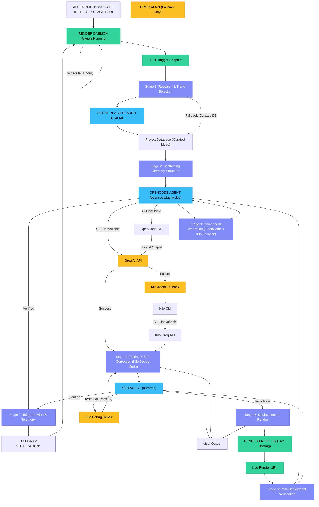

# Autonomous AI Website Builder - System Architecture

## 1. System Overview

This project implements an **Autonomous AI Website Builder** that runs a 7-stage development loop entirely on **Render Free Tier**. The system uses **OpenCode** and **KiloCode** as the exclusive coding and testing agents, with real-time Telegram notifications for status updates.

**Key Constraints:**
- All coding and testing performed EXCLUSIVELY by OpenCode and KiloCode agents
- No pre-existing templates
- No external codebase imports for generation
- Deployment target: Render Free Tier

---

## 2. 7-Stage Development Loop



---

## 3. Core Components

### 3.1 Render Daemon (`daemon.js`)
- Always-running HTTP server on Render
- Self-pings every 5 minutes to prevent free-tier sleep
- Exposes `/trigger` endpoint for webhook-triggered builds
- Schedules recurring build cycles (default: every 60 minutes)

### 3.2 Master Autonomous Engine (`autonomous_engine.js`)
- Orchestrates the 7-stage development loop
- Enforces OpenCode + Kilo exclusivity for all coding/testing
- Manages Render deployment via API or webhook
- Coordinates Telegram notifications

### 3.3 OpenCode Agent (`opencode_agent.js`)
- Primary coding agent (model: `opencode/big-pickle`)
- Generates website code via CLI or Groq AI API fallback
- Runs QA tests on generated code
- Verifies deployed websites

### 3.4 Kilo Agent (`kilo_agent.js`)
- Secondary coding and debugging agent (model: `autofree`)
- Handles code repair and self-correction loops
- Runs QA tests with bounded retry limits (max 3 attempts)
- Verifies deployed websites

### 3.5 Telegram Notifier (`telegram_notifier.js`)
- Centralized notification hub
- Sends real-time status updates for:
  - Stage start/completion/failure
  - Agent fallback events
  - Render trigger received
  - CLI availability checks
  - Full cycle completion

### 3.6 AgentReach Search (`agent_reach.js`)
- Web search integration via Exa AI
- Used in Stage 1 for trending topic discovery

---

## 4. Data Flow

```
User/Webhook Trigger
    ↓
Render Daemon
    ↓
Stage 1: Research (AgentReach + Project DB)
    ↓
Stage 2: Scaffolding (OpenCode CLI)
    ↓
Stage 3: Code Generation (OpenCode → Kilo Fallback → Groq API)
    ↓
Stage 4: Testing & Repair (Kilo Debug Mode, max 3 attempts)
    ↓
Stage 5: Render Deployment (API/Webhook)
    ↓
Stage 6: Verification (OpenCode + Kilo)
    ↓
Stage 7: Telegram Notification
    ↓
Live Website on Render
```

---

## 5. Agent Exclusivity Model

| Task | OpenCode | KiloCode | Other |
|------|----------|----------|-------|
| Code Generation | Primary | Fallback | PROHIBITED |
| Testing | QA Tests | Debug/Repair | PROHIBITED |
| Verification | Live Audit | Live Audit | PROHIBITED |
| Documentation | Doc Gen | Doc Gen | Allowed |
| Deployment | Render API | Render API | Allowed |

**NO templates. NO external codebases. Agents only.**

---

## 6. Render Free Tier Optimization

- **Self-ping**: Every 5 minutes via `RENDER_EXTERNAL_URL`
- **Webhook trigger**: External cron can hit `/trigger` endpoint
- **Bounded retries**: Max 3 attempts per stage to avoid timeout
- **Fast execution**: Optimized prompts and minimal dependencies

---

## 7. Observability

- All stages logged via `observability.js`
- Metrics exported: `code_generation_duration_ms`, `total_autonomous_cycle_duration_ms`, `telegram_alerts_sent`
- Telegram provides real-time human-readable status
- OpenObserve telemetry available (optional)

---

## 8. File Structure

```
services/
├── autonomous_engine.js   # 7-stage loop orchestrator
├── daemon.js              # Render HTTP server & scheduler
├── opencode_agent.js      # OpenCode CLI controller
├── kilo_agent.js          # Kilo CLI controller
├── telegram_notifier.js   # Centralized Telegram notifications
├── telegram_bot.js        # Telegram bot controller
├── agent_reach.js         # Exa AI web search
├── observability.js       # Logging & metrics
├── paperclip_agent.js     # Documentation only (deprecated for code)
└── ai_generator.js        # Deprecated utility (agents only)

dist/
└── <project-name>/
    ├── index.html         # Generated by OpenCode/Kilo
    ├── package.json       # Generated by engine
    ├── ARCHITECTURE.md    # Generated by agents
    ├── README.md          # Generated by agents
    ├── sitemap.xml        # Generated by engine
    └── robots.txt         # Generated by engine
```

---

## 9. Security & Constraints

- **No hardcoded templates**: All HTML/CSS/JS generated by AI agents
- **No external codebase imports**: No copying from GitHub, StackOverflow, etc.
- **API keys in env only**: Never committed to Git
- **Render free tier**: No automatic paid spending
- **Agent fallback policy**: CLI → Groq API → Secondary Agent → Fail
