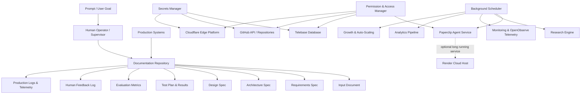

# Autonomous AI System & Website Builder Architecture

## 1. System Overview
This project defines an **Autonomous Software Engineering & Operations Platform**. The system integrates multi-agent AI orchestration, document management, permission governance, cloud secrets management, and automated background schedulers to deliver continuous web application builds and deployments.

---

## 2. Core Architecture Modules

---

## 3. Subsystem Breakdown

### 3.1 Document Store (`DOCUMENTS`)
- **`INPUT_DOC`**: Raw user instructions and task prompts.
- **`REQUIREMENT_DOC`**: Structured Product Requirement Documents (PRDs).
- **`ARCH_DOC_STORE`**: System architecture topology, schemas, and API specs.
- **`DESIGN_DOC`**: Frontend design guidelines, component trees, and token mappings.
- **`TEST_DOC`**: Test suites, integration test results, and coverage metrics.
- **`EVAL_DOC`**: Benchmark results, token usage evaluations, and cost models.
- **`HUMAN_DOC`**: Operator feedback logs and manual override history.
- **`PROD_DOC`**: Live production error tracebacks, performance metrics, and logs.

### 3.2 Security & Access Layer (`PERMISSION` & `SECRETS`)
- **Permission Manager**: Role-based access control (RBAC) governing bot operations across GitHub, Cloudflare, Telebase, and Paperclip.
- **Secrets Manager**: Encrypted vault for API tokens, SSH keys, deployment credentials, and database URIs.

### 3.3 Task Execution & Automation (`SCHEDULER` & `PAPERCLIP`)
- **Background Scheduler**: Cron-based and event-driven trigger system executing routine maintenance, research, monitoring, analytics, and growth jobs.
- **Paperclip Agent**: Core background executor for heavy autonomous agent workflows, optionally offloaded to **Render** or **Cloudflare Workers**.

---

## 4. Low-Data Live Deployment Strategy
To conserve local internet bandwidth:
1. **Push Only Code Changes (KBs)**: Local development writes pure text files.
2. **Cloud Infrastructure Builds**: GitHub triggers webhooks to Cloudflare Pages/Vercel.
3. **Automatic Live Preview**: Deployment finishes online within seconds without downloading local dependencies.
